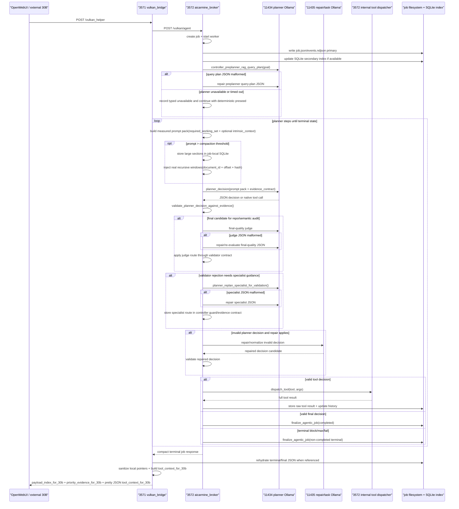

<!-- AICARMINE_NON_NEGOTIABLE_CONTRACT_START -->
Regole operative non negoziabili:
1. Il contratto non va modificato se non richiesto da Carmine esplicitamente.
2. Il prodotto finale puo' essere arricchito come gia' viene fatto; non cambiare logica senza richiesta esplicita.
3. Non devi presupporre nulla: non e' il tuo compito.
<!-- AICARMINE_NON_NEGOTIABLE_CONTRACT_END -->
# End-To-End Agentic Flow

Updated: 2026-06-15

This document describes the real runtime chain verified against the current
code. It is documentation only. It must not be used to justify changing
launcher, model, context, max steps or validator logic without separate
evidence.

Visual runtime map: [`../flow.svg`](../flow.svg).

## Canonical Flow

Port names in this document use the real runtime numbers:

- `3571`: public OpenWebUI bridge.
- `3572`: internal agent broker/runtime.
- `11434`: main planner Ollama endpoint.
- `11435`: task/repair Ollama endpoint.



Codex MCP servers under `services/codex_bridge/` are outside this chain. They
expose host-side Codex tools over MCP stdio and must not be modeled as 3571
public tools, planner-native 3572 tools, or a shortcut into `/vulkan/agent`.
If those MCP servers import broker repo tools, they first resolve the
Codex-selected repo root and rewrite only their own process'
`AICARMINE_LAB_REPO`; this prevents import-time broker config drift without
requiring the OpenWebUI/3572 lab shadow to equal the Codex root.

## Owner Matrix

| Runtime edge | Owning code | Verified behavior |
| --- | --- | --- |
| OpenWebUI -> 3571 | `services/vulkan_bridge/app.py` | Generated OpenAPI exposes only `/vulkan_helper` through `OPENWEBUI_VISIBLE_TOOL_ALIASES`. |
| 3571 -> 3572 | `services/vulkan_bridge/app.py` | `_handle_helper()` posts the normalized agent payload to `AGENT_URL`, default `http://127.0.0.1:3572/vulkan/agent`. |
| 3572 route -> job worker | `services/aicarmine_broker/app.py`, `services/aicarmine_broker/agent_entry.py` | `/vulkan/agent` delegates to `agent()`, `vulkan_helper` starts a job, and `agent_job_worker()` calls `run_agentic_planner_job()`. |
| 3572 -> 11434 | `services/aicarmine_broker/planner.py`, `services/aicarmine_broker/application/planner/turn.py`, `services/aicarmine_broker/application/prompt/pack_builder.py`, `services/aicarmine_broker/application/controller/rag_preseed.py`, `services/aicarmine_broker/application/evidence/final_quality.py`, `services/aicarmine_broker/planner_intrinsic_context.py`, `services/aicarmine_broker/planner_core/json_io.py`, `services/aicarmine_broker/memory_tools.py`, `services/aicarmine_broker/config/` | `planner_decision()` is still the compatibility entrypoint, but measured prompt packing, one-turn calls, preplanner query-plan repair, final-quality judging and replan-specialist guidance are owned by application modules and orchestrated by `planner.py`. Above the prompt compaction threshold it stores large sections in job-local SQLite and injects `planner_prompt_context_window.v1` windows. The stream transport records both response-header wait and stream-read timeouts; default `PLANNER_URL` is `http://127.0.0.1:11434/api/chat`. |
| 3572 -> 11435 | `services/aicarmine_broker/planner.py`, `services/aicarmine_broker/tool_selection.py`, `services/aicarmine_broker/config/` | Repair/selector paths use `OLLAMA_TASK_URL`; default is `http://127.0.0.1:11435/api/chat`. GPU0 repair is explicit and bounded: it may repair malformed planner emissions or invalid non-code-product proposals, but it must not mask code-product contract failures. |
| 3572 -> internal tools | `services/aicarmine_broker/planner.py`, `services/aicarmine_broker/application/planner/validator.py`, `services/aicarmine_broker/tool_dispatch.py`, `services/aicarmine_broker/application/tool_surface/dispatcher.py`, `services/aicarmine_broker/tools/*` | Validated tool decisions call `dispatch_tool()`, which is a compatibility facade over the registry dispatcher. Concrete repo, terminal, memory and helper behavior lives in the owning tool modules. |
| 3572 -> terminal compact result | `services/aicarmine_broker/planner.py`, `services/aicarmine_broker/application/planner/loop.py`, `services/aicarmine_broker/job_store.py`, `services/aicarmine_broker/application/job/terminal_response.py` | `finalize_agentic_job()` writes final state; `wait_for_agent_terminal()` returns `compact_agent_terminal_response()`, whose terminal payload shaping is delegated to the job/public payload application modules. |
| 3571 -> OpenWebUI terminal response | `services/vulkan_bridge/app.py` | `_agentic_v9_build_openwebui_response()` returns the stable public surface for both ok and non-ok terminal jobs: primary metadata, `payload_index_for_30b`, `priority_evidence_for_30b`, `openwebui_usage` and pretty JSON `tool_context_for_30b`. It does not promote blocked/prose narrative fields as the primary answer. |

## Operational Storage And Public Payload Guarantees

The same terminal job can have multiple internal storage surfaces, but only one
public payload contract.

- Filesystem job state and event files are the operational source of truth.
  SQLite is a secondary dashboard/index cache. If SQLite fails, the job still
  writes `job.json` and `events.ndjson`, records a typed persistence warning and
  remains recoverable from filesystem fallback listing.
- `final_path`, `final_json`, `reads/*.json`, `tool-results/*.json`,
  job-local SQLite document ids and `C:\Users\...` paths are operator/internal
  pointers. 3571 may read a verified local JSON only to rehydrate the same
  terminal/tool payload before returning to OpenWebUI.
- The public OpenWebUI payload must not require local filesystem access. Real
  content is transported inline through `payload_index_for_30b`,
  `priority_evidence_for_30b`, `openwebui_usage`, `tool_context_for_30b` and
  `result` when present.
- Complete payloads are canonical under
  `tool_context_for_30b.artifacts[*].artifact`. `priority_evidence_for_30b`
  is pointer-first and bounded: it keeps metadata, hashes, item locations and
  small summaries, but it must not duplicate large `content`,
  `unified_diff` or `structured_operations` already present in tool context.
  `payload_index_for_30b.concrete_results[*].primary_location` must point to
  the canonical inline payload field.
- The public shape is stable across `completed`, `blocked_needs_attention`,
  `max_steps_reached`, `failed` and `cancelled`. Internal completion/block
  status is payload metadata under `openwebui_usage.internal_job_status` and
  `payload_index_for_30b.internal_job_status`, not a top-level `job_ok` field
  and not permission to drop inline payloads.
- Command tools classify every command as `readonly`, `validation`, `write`,
  `destructive` or `unknown`. Non-readonly/non-validation commands require the
  explicit consent path and return typed policy payloads when blocked.
- Runtime SQLite memory cleanup is dry-run unless `apply=true` has explicit
  consent. Planner memory surfaces report `memory_feature_available`,
  `memory_query_ok` and `memory_records_available` separately.

## Active Repository Root

The active repository for planner repo tools is `AICARMINE_LAB_REPO`. A job can
therefore analyze a lab worktree such as
`C:\Users\carmi\AI\lab-worktrees\blender-audio-project-lab` even when the Codex
thread cwd is `C:\Users\carmi\AI`.

Do not infer repo-tool validity from the Codex cwd. For every job, use
`user_payload.lab_repo` in the captured planner payload to identify the active
root.

Contract invariant:

- `repo_read`, `repo_tree`, `repo_list_files`, `repo_search`,
  `repo_propose_code_edit`, validation and patch/report-only code-product
  logic all resolve repo-relative paths against `AICARMINE_LAB_REPO`.
- `candidate_next_actions` and `validator_admissible_repo_read_paths` must be
  derived from the same `AICARMINE_LAB_REPO`.
- A `repo_read` candidate exposed to the planner must either be admissible to
  the validator or be removed before prompt construction. The controller must
  not recommend a path that the validator will reject as not from prior/current
  evidence.
- Open Terminal cwd is expected to mirror `AICARMINE_LAB_REPO` through
  `OPEN_TERMINAL_CWD` / `AICARMINE_OPEN_TERMINAL_WORKDIR`; if it does not,
  treat that as a runtime-root mismatch before debugging model behavior.

For non-completed terminal jobs, the wrapper may also surface useful rejected
planner output, repair text or code-product attempts as explicit partial
products. These live under `tool_context_for_30b.partial_products_for_30b` and
`payload_index_for_30b.partial_results`, with `validator_accepted=false`; they
are visible to OpenWebUI but do not satisfy the successful code-product gate.

Non-ok terminal jobs must keep the same public shape as ok jobs. The difference
is terminal status/warning metadata inside the indexed payload, not a different
payload contract or a top-level `job_ok` flag. If `final.json`/the terminal payload contains `result`, 3571
must prefer that terminal `result` over the compact transport digest from
`compact_agent_terminal_response()`. Raw `result.history` is normalized to the
public ledger schema; a compact `{ "preview": ... }` result is only a fallback
when no terminal `result` is available.

## 3572 IA Live Control View

3572 exposes an operator-only, read-only control view under the existing job
dashboard namespace:

- `GET /jobs/{job_id}/ia-view`
- `GET /jobs/{job_id}/ia-view.json`

This view is not part of the 3571/OpenWebUI public tool surface and is not a
planner tool. It reads existing job state, events, planner prompt captures,
planner stream files and tool-result artifacts, then renders what the planner
actually saw per turn. It must not start, continue, repair, cancel or mutate a
job.

The JSON view shows:

- prompt payload sent to 11434, including `required_working_set`,
  `optional_context.intrinsic_context`, `evidence_contract` and budget report;
- planner decision/stream output;
- compact tool result fed back into planner history;
- raw tool result rehydrated inline from the same job workspace;
- validator guard/rejection;
- terminal `tool_context_for_30b` when available.

The view also audits payload transport. If a raw tool result contains required
fields but the compact payload only carries previews, metadata or a local
artifact path, the view marks the violation explicitly.

## Contract Proof Bundle

For significant run diagnosis, use a proof bundle assembled from already
persisted, read-only sources:

- `job.json` for job status, goal, workspace and current step;
- `events.ndjson` for planner request/decision, validator guard, tool start and
  tool result events;
- `final.json` for the terminal payload actually available at job completion;
- terminal `payload_index_for_30b`, `priority_evidence_for_30b` and
  `tool_context_for_30b` for OpenWebUI-visible inline evidence;
- planner prompt capture and planner stream for what 11434 received and
  returned;
- compact tool result plus the raw same-job `tool-results` artifact for what
  was fed back, compacted or rehydrated;
- `/jobs/{job_id}/ia-view.json` as the operator index over those sources.

Do not diagnose from rendered HTML, local artifact paths or model intuition
alone. HTML and IA view rendering are navigation/presentation layers; the proof
is the raw artifact or inline public payload field they point to.

## Code-Backed Proof Points

### 1. OpenWebUI sees only `vulkan_helper`

Code owner: `services/vulkan_bridge/app.py`

- `OPENWEBUI_VISIBLE_TOOL_ALIASES = ("vulkan_helper",)`.
- `_native_helper_openapi()` builds the OpenAPI schema from only those visible
  aliases.
- The Python app still defines compatibility POST routes such as
  `/helper_for_all`, `/repo_read` and `/repo_command`, but they are not exposed
  in the OpenWebUI OpenAPI surface.

Implication: OpenWebUI should register
`http://127.0.0.1:3571/openapi.json` and call `vulkan_helper`.

### 2. 3571 forwards the request to 3572

Code owner: `services/vulkan_bridge/app.py`

- `AGENT_URL` defaults to `http://127.0.0.1:3572/vulkan/agent`.
- `vulkan_helper_public()` calls `_handle_helper()`.
- `_handle_helper()` builds the agent payload and calls `_post_json(AGENT_URL,
  agent_payload, timeout=...)`.

Implication: 3571 is a public bridge and result wrapper. It is not the internal
planner loop owner.

### 3. 3572 receives `/vulkan/agent` and starts the job

Code owners:

- `services/aicarmine_broker/config/compatibility.py`
- `services/aicarmine_broker/app.py`
- `services/aicarmine_broker/agent_entry.py`

Verified behavior:

- `VULKAN_AGENT_PATH` defaults to `/vulkan/agent`.
- `app.py` registers `ask_vulkan_agent()` on that path and delegates to
  `agent_entry.agent()`.
- For public `vulkan_helper` without an existing `job_id`, `agent()` resolves
  the action to `start`.
- `start_agent_job()` writes queued job state and starts `agent_job_worker()`.
- `agent_job_worker()` calls `run_agentic_planner_job()` when
  `AGENTIC_PLANNER_ENABLED` is true.

Implication: the agentic loop starts inside 3572, not inside OpenWebUI and not
inside 3571.

### 4. 11434 is the planner turn endpoint

Code owners:

- `services/aicarmine_broker/config/compatibility.py`
- `services/aicarmine_broker/planner.py`
- `services/aicarmine_broker/planner_core/json_io.py`

Verified behavior:

- `PLANNER_URL` defaults to `http://127.0.0.1:11434/api/chat`.
- `PLANNER_MODEL` is read from planner env variables or defaults in
  `services/aicarmine_broker/config/models.py` and exposed through
  `services/aicarmine_broker/config/compatibility.py`.
- `planner_decision()` builds a payload with `history`,
  `turn_memory`, `evidence_contract`, tool schemas and response protocol
  instructions.
- It calls `post_json_stream_to_file(PLANNER_URL, planner_payload, ...)`.
- The stream helper records both `planner_stream_started` and typed waiting or
  timeout events for the response-header phase. If `urlopen()` blocks before
  headers, the internal readline deadline cannot help; the header wait guard is
  the owner for that failure mode.
- Preplanner query-plan, final-quality judge and replan-specialist repair
  requests also use 11434. They are guidance lanes, not hidden controller
  dispatch: malformed JSON can be repaired by the planner model, but accepted
  actions still pass through the normal planner/validator sequence.

Implication: 11434 chooses the next planner action. Its Ollama
`done_reason` is turn metadata; it does not by itself complete the 3572 job.

#### Native tool calling contract

When `AICARMINE_AGENTIC_PLANNER_NATIVE_TOOLS=true` and
`AICARMINE_AGENTIC_PLANNER_REQUIRE_NATIVE_TOOLS=true`, tool execution decisions
must use Ollama native `message.tool_calls`.

- `action=tool` as JSON text is not executable planner output in native mode.
  The validator rejects it before dispatch.
- `final` and `block` are terminal decisions, not tool dispatch requests. They
  may be strict JSON text or natural terminal prose wrapped by the controller
  as `final_answer` before normal validation.
- The planner payload includes native `tools` schema for internal 3572 tools.
  That schema is internal to 3572 and must not change the public 3571/OpenWebUI
  tool surface.
- Native `tool_batch` is a controller-normalized internal form for parallel
  read-only calls only. Each sub-call is validated like a single tool decision.
- Native tool-call messages are planner working history. They are not the
  source of the final OpenWebUI payload; persistent job `history` plus raw tool
  artifacts are.

Regression signal: a planner text JSON tool call reaching `dispatch_tool()` in
native-required mode means the native gate failed. A terminal `final`/`block`
decision, including controller-wrapped terminal prose, being rejected only for
lack of `tool_calls` means the gate is incorrectly applied to non-tool
decisions.

### 5. 3572 validates, then dispatches tools

Code owners:

- `services/aicarmine_broker/planner.py`
- `services/aicarmine_broker/application/planner/validator.py`
- `services/aicarmine_broker/tool_dispatch.py`
- `services/aicarmine_broker/application/tool_surface/dispatcher.py`
- `services/aicarmine_broker/tools/*`

Verified behavior:

- Every planner decision is checked by
  `validate_planner_decision_against_evidence()`.
- If a tool decision is valid, 3572 calls `dispatch_tool()` with the normalized
  internal tool and sanitized args.
- `dispatch_tool()` is the compatibility facade. The explicit registry lives
  in `application/tool_surface/dispatcher.py`, while concrete repo, terminal,
  memory and helper behavior lives in the owning modules under `tools/` and
  `memory_tools.py`.
- Tool results are written under the job workspace and compacted into planner
  history for the next turn.

Current tool surface:

- Public OpenWebUI surface on 3571: `/vulkan_helper` only.
- Internal 3572 planner surface:
  `repo_capabilities`, `repo_status`, `repo_tree`, `repo_search`,
  `repo_fd_files`, `repo_rg_search`, `repo_jq_query`,
  `repo_ast_grep_search`, `repo_ast_grep_dry_run`,
  `repo_tree_sitter_parse`, `repo_unidiff_validate`,
  `repo_git_apply_check`, `repo_ruff_check`, `repo_pyright_check`,
  `repo_pytest_run`, `repo_shellcheck`, `repo_ctags_symbols`,
  `repo_semgrep_scan`, `repo_hyperfine_benchmark`, `repo_read`,
  `repo_list_files`, `repo_propose_code_edit`,
  `repo_apply_patch`, `repo_write_file`, `repo_validate`, `repo_command`,
  `terminal_run_command_wait`, `terminal_search_files`,
  `terminal_list_files`, `planner_scratchpad_read`,
  `planner_scratchpad_write`, `runtime_sqlite_memory_search`,
  `runtime_sqlite_memory_write`, `runtime_sqlite_memory_cleanup`,
  `vulkan_helper`.
- Write-guarded internal tools:
  `repo_apply_patch`, `repo_write_file`, `repo_command`,
  `terminal_run_command_wait`, `runtime_sqlite_memory_cleanup`.
- `repo_propose_code_edit` is internal, read-only and report-only. It produces
  a complete `code_edit_proposal` payload for diff/refactoring/code-product
  goals and must not write source files or apply patches.
- Deterministic adapters (`repo_fd_files`, `repo_rg_search`, `repo_jq_query`,
  AST/diff validators, Python/shell/security checks and explicit-consent
  `repo_hyperfine_benchmark`) are internal support tools only. They are exposed
  by the planner surface per turn, according to the request class and
  `required_next_progress`; they are not public 3571 tools and they do not
  replace `repo_read`, complete diff payloads or final OpenWebUI transport.

Implication: 3572 is both validator and dispatcher. It may reject or execute a
planner proposal, but it must not secretly invent a different tool sequence.

### 5a. Code product lane is not an apply lane

Code owner:

- `services/aicarmine_broker/planner.py`
- `services/aicarmine_broker/application/evidence/goal_classifier.py`
- `services/aicarmine_broker/application/code_product/*`
- `services/aicarmine_broker/tools/repo_code_product.py`
- `services/aicarmine_broker/code_edit_proposal_contract.py`
- `services/aicarmine_broker/tool_registry.py`
- `services/aicarmine_broker/tool_dispatch.py`
- `services/aicarmine_broker/application/tool_surface/dispatcher.py`

Verified behavior:

- Goals asking for a diff, unified diff, concrete refactoring, patch proposal
  or code product require `repo_propose_code_edit` before finalization.
- While that valid proposal is missing,
  `evidence_contract.finalization_contract.final_allowed=false`,
  `planner_may_choose_final=false` and `required_next_progress` points back to
  `repo_propose_code_edit`.
- The target must have been read with `repo_read` before the proposal.
- A valid proposal carries `kind=code_edit_proposal`, `target_file`,
  `edit_kind`, `rationale`, `validation_commands`, full `unified_diff` or full
  `structured_operations` or explicit `no_op`, and report-only flags.
- `artifact` is an audit copy path/result for the same tool. It is not enough
  without the inline diff/operations payload.
- Apply/edit/fix/write goals remain separate and require `repo_apply_patch`
  plus validation when the user actually asks to modify files.

### 5b. Intrinsic context is not a tool surface

Code owner:

- `services/aicarmine_broker/planner.py`
- `services/aicarmine_broker/planner_intrinsic_context.py`
- `services/aicarmine_broker/config/compatibility.py`

Verified behavior:

- Before every 11434 planner call, 3572 injects
  `schema=planner_intrinsic_context.v1`.
- The context contains `goal_classification`, `retrieved_memory`,
  `retrieved_rag_chunks`, `repo_map_summary`, `failure_patterns`,
  `tool_purpose_manifest` and `budget_report`.
- `rag.sqlite` is read through SQLite/FTS5 in read-only mode when present; a
  missing DB/schema is reported as a typed gap, not as invented context.
- If `RAG_RERANKING_ENGINE=external`, the configured external reranker may
  reorder already retrieved chunks inside the builder. If it is down, the
  context reports `rerank.status=unavailable` and keeps the ranking source
  explicit.
- Current code-backed rerank bounds are: FTS candidate pool `80`, reranker
  input `12`, per-document cap `2500` chars and timeout `30.0` seconds.
  `candidate_count` records the FTS pool; reranker `input_count` records only
  the posted `/v3/rerank` documents.
- RAG/chunk/intrinsic context names are not added to `PLANNER_INTERNAL_TOOLS`.
- `runtime_sqlite_memory_search/write` and `planner_scratchpad_*` remain
  selective follow-up tools only after intrinsic context leaves a concrete gap.
- When the prompt pack exposes an explicit required continuation
  (`required_next_tool_call` / `prompt_context_continuation_required`) for a
  `planner_prompt_context_window.v1`, the next valid planner action is
  `planner_scratchpad_read` for that document window. A different action is
  rejected as `prompt_context_continuation_required`; that rejection is not
  routed to 11435 repair. A `repo_read` window with `has_more_after=true`
  without that explicit continuation is optional adjacent context, not a final
  gate.

### 6. 11435 is repair/task support, not the main planner

Code owners:

- `services/aicarmine_broker/config/compatibility.py`
- `services/aicarmine_broker/planner.py`
- `services/aicarmine_broker/tool_selection.py`

Verified behavior:

- `OLLAMA_TASK_URL` defaults to `http://127.0.0.1:11435/api/chat`.
- `OLLAMA_TASK_MODEL` defaults to the task model env/default.
- 11435 is used for selector/repair/normalization paths such as
  `vulkan_repair_invalid_planner_decision()`.
- Repaired decisions still pass the 3572 evidence validator before execution.
- Semantic code-product contract failures such as missing rationale, missing
  complete diff, target not read, or invalid `repo_propose_code_edit` payload do
  not route to 11435 repair. They remain validator guard feedback for the next
  planner turn.
- `code_product_contract.required=true` blocks 11435 repair even if the
  rejected decision is a tool proposal. Code-product loops should be guided by
  validator feedback and the 11434 replan specialist, not by GPU0 repair.

Implication: 11435 does not replace 11434 as planner and does not decide job
completion.

### 7. Finalization is planner-final plus validator acceptance

Code owner: `services/aicarmine_broker/planner.py`

Verified behavior:

- If the planner emits `action=final`, 3572 first validates the decision.
- Only after validation succeeds does `run_agentic_planner_job()` call
  `finalize_agentic_job(..., "completed", final_answer, ...)`.
- If the decision is invalid, 3572 records a controller guard/rejection and the
  loop continues or reaches a terminal blocked/max-step state.

Implication: `completed` means the planner final was accepted by the controller
gate. It is not equivalent to "Ollama stream done".

### 8. 3572 returns terminal state to 3571, then 3571 wraps for OpenWebUI

Code owners:

- `services/aicarmine_broker/job_store.py`
- `services/vulkan_bridge/app.py`

Verified behavior:

- `wait_for_agent_terminal()` waits until a configured terminal status and then
  returns `compact_agent_terminal_response()`.
- `compact_agent_terminal_response()` includes job metadata, answer fields and
  structured context from final/state when available.
- 3571's v9 wrapper recognizes terminal agent results and calls
  `_agentic_v9_build_openwebui_response()`.
- For terminal results, 3571 returns a sealed public object with stable primary
  metadata, `payload_index_for_30b`, top-level `priority_evidence_for_30b` for
  the most important complete payloads, `openwebui_usage`, and a pretty-printed
  JSON string `tool_context_for_30b`.
- The sealed terminal shape is identical for completed and non-completed
  terminal jobs. Do not branch into a smaller blocked/failure response shape:
  keep `payload_index_for_30b`, `priority_evidence_for_30b`,
  `openwebui_usage`, `tool_context_for_30b` and terminal `result` when present.
- `result` source precedence is terminal/final payload first, compact response
  fallback second. The compact `result.preview` digest must not shadow the
  terminal `result` loaded from the terminal payload.
- The public `result` must not inline raw controller audit history when that
  history would dominate the OpenWebUI context. `result.history` is exposed as
  `agentic_terminal_public_history_ledger.v1`: step, action, tool, reason,
  target/result facts and complete code-product payloads when present. Raw
  audit detail remains internal job evidence; it is not a substitute for
  `tool_context_for_30b`.
- `priority_evidence_for_30b` is an index for model navigation, not a
  replacement for `tool_context_for_30b`: code-edit proposals expose complete
  `unified_diff`/`structured_operations`, complete file requests expose full
  `content`, and repo analysis exposes a compact evidence map plus planner
  summary.
- `_agentic_v9_build_openwebui_response()` preserves real successful tool
  payloads inline as `tool_context_for_30b.artifacts[*].artifact`; local
  JSON/SQLite/job paths are not a substitute for content visible to OpenWebUI.

Implication: OpenWebUI receives indexed inline real successful tool evidence.
It must not be expected to open local job paths or treat a blocked/prose
narrative as the primary result.

## What Must Stay True

- 3571 is the public OpenWebUI bridge.
- 3572 owns the internal agentic loop.
- 11434 is the main planner turn endpoint.
- 11435 is selector/repair/task support.
- 3572 validates planner decisions and dispatches tools.
- Tool execution results must be real results, not only local artifact paths.
- Code-product tool results must carry the complete diff or structured
  operations inline; preview/summary fields are not substitutes.
- Final job completion is controlled by the 3572 validator/finalization flow.
- 3571 wraps terminal output for OpenWebUI; it must not expose continuation
  protocol as the final user-visible result.
- 3571 must not regress non-ok terminal jobs to a reduced or preview-only
  payload. The top-level shape stays the same as ok; terminal
  status/warning metadata inside `openwebui_usage` and `payload_index_for_30b`
  indicates failure/block/max/cancel.
- 3572 must keep the native tool surface coherent with
  `required_next_progress`. If code-product progress says the target is already
  read and asks for `code_product_build_state`, repo navigation tools must not
  remain exposed for that turn. If final is required and allowed, tools are not
  exposed unless a final-composition tool is explicitly listed.

## Diagnostic Checklist

When this flow breaks, prove the failed edge:

1. OpenWebUI sees only `/vulkan_helper` from `3571/openapi.json`.
2. 3571 `/health` reports `agent_url` as `http://127.0.0.1:3572/vulkan/agent`.
3. 3572 `/health` reports the expected `planner_url`, `planner_model`,
   `ollama_task_url` and `ollama_task_model`.
4. A 3572 job has events for `agentic_loop_started`,
   `planner_request_started`, `planner_decision`, and either `tool_result` or
   validator rejection.
5. If a final exists, `final.json` contains planner final data and structured
   context.
6. 3571 `POST /vulkan_helper {"action":"result","job_id":"..."}` returns
   `payload_index_for_30b`, `priority_evidence_for_30b.items[*]`,
   `openwebui_usage` and `tool_context_for_30b.artifacts[*].artifact` inline;
   local paths, SQLite document ids and job artifact paths must not be required
   for OpenWebUI to understand the result.

## Operational Stop Proof

When a runaway or stuck job path is suspected, prove the process edge before
stopping anything:

1. Inspect port ownership for `3571`, `3572`, `11434` and `11435`.
2. Match each PID to command line, especially
   `aicarmine-vulkan-tool-broker.ps1`, `uvicorn ... --port 3571`,
   `ollama-task-vulkan.ps1` and task `ollama.exe serve`.
3. To stop GPU0/task repair without touching the main planner, stop only the
   `ollama-task-vulkan.ps1` tree and its child `ollama.exe` on `11435`.
4. To stop new bridge-launched jobs, stop the
   `aicarmine-vulkan-tool-broker.ps1`/3571 tree. `11434` can remain alive if the
   user wants the main Ollama instance untouched.
5. Verify after stop that `11435` and `3571` are absent from listening ports.
   A `3572` `TIME_WAIT` row with `OwningProcess=0` is not a live listener.

Do not infer that the service venv is broken from a stalled GPU/task process.
There are two separate runtime families:

- 3571/3572 use Python from `C:\Users\carmi\AI\venvs\labtools` unless a launcher
  override changes it;
- 11435 is the dedicated Ollama task instance for GPU0 Intel via Vulkan. It is
  a separate `ollama.exe serve` process launched by
  `services\ollama-task-vulkan.ps1` with `OLLAMA_HOST=127.0.0.1:11435`,
  `OLLAMA_MODELS=C:\Users\carmi\AI\models-task`, `OLLAMA_VULKAN=1` and
  `GGML_VK_VISIBLE_DEVICES`. GPU0 here means the Intel device role; the Vulkan
  visible-device index must be the resolved Intel Vulkan index, not assumed from
  the Windows/NVIDIA numbering.

Use the active 3571/3572 venv path directly when checking bridge/broker imports:

```powershell
& 'C:\Users\carmi\AI\venvs\labtools\Scripts\python.exe' -c "import fastapi, uvicorn; import aicarmine_broker.app, vulkan_bridge.app; print('labtools_runtime_import_ok')"
```

Use process, port ownership and Vulkan/Intel device env, not Python imports, to
diagnose 11435.
