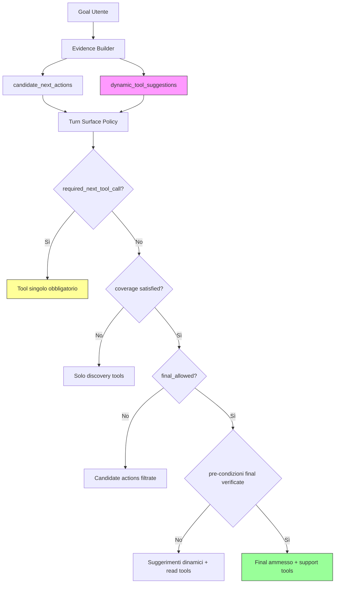

# Dynamic Tool Surface — Piano Architetturale

## Obiettivo

Rendere dinamica la surface degli strumenti disponibili nel planner loop, in modo che il validator/controller suggerisca gli strumenti in base alla richiesta corrente o allo stato del loop. Esempio concreto: la chiamata `final` è ammessa solo dopo che i file indicati sono stati letti.

---

## Analisi dell'esistente

### 1. Strumenti statici (`tool_schemas.py`)

- [`PLANNER_INTERNAL_TOOLS`](services/aicarmine_broker/tool_schemas.py:645) — Tuple hardcoded di ~32 tool interni
- [`OPENWEBUI_PUBLIC_TOOLS`](services/aicarmine_broker/tool_schemas.py:684) — Subset esposto a OpenWebUI
- [`WRITE_GUARDED_TOOLS`](services/aicarmine_broker/tool_schemas.py:718), [`STATE_MUTATING_TOOLS`](services/aicarmine_broker/tool_schemas.py:729), [`COMMAND_EXEC_TOOLS`](services/aicarmine_broker/tool_schemas.py:740) — Classificazioni per categoria

**Problema**: Questi insiemi sono **statici**. Non cambiano durante il loop.

### 2. Tool Surface Policy (`turn_surface_policy.py`)

[`ToolSurfacePolicy`](services/aicarmine_broker/application/tool_surface/turn_surface_policy.py:26) gestisce quali strumenti sono disponibili per ogni turno attraverso:

- `_REPO_DISCOVERY_TOOLS` (linea 34-41): repo_read, repo_list_files, repo_tree, etc.
- `_NON_TERMINAL_SUPPORT_TOOLS` (linea 56-62): planner_scratchpad_*, runtime_sqlite_memory_*
- `_ALWAYS_AVAILABLE_SUPPORT_TOOLS` (linea 63-68): subset fisso di support tools

Il metodo [`tools_for_turn()`](services/aicarmine_broker/application/tool_surface/turn_surface_policy.py:73) decide gli strumenti permessi con una catena di if/else basata su:
- `required_next_tool_call` → tool singolo obbligatorio
- `contract_coverage_required/satisfied` → solo discovery tools se coverage non soddisfatto
- `terminal_policy_locks_surface` → surface bloccata da policy precedente
- `semantic_goal_classification.class` → base tools per goal class

**Problema**: La logica è **basata su stati fissi**, non su un modello dinamico che impara dallo stato del loop e dalla richiesta utente.

### 3. Evidence Contract (`builder.py`, `evidence_contract.py`)

L'evidence contract contiene già i semi della dynamic behavior:

- [`candidate_next_actions`](services/aicarmine_broker/application/evidence/builder.py:402): Azioni suggerite dal builder basato su evidenze raccolte
- [`required_next_tool_call`](services/aicarmine_broker/application/tool_surface/candidate_actions.py:521): Tool specifico richiesto prima di procedere
- [`finalization_contract.final_allowed`](services/aicarmine_broker/application/prompt/evidence_contract.py:34): Flag booleano che dice se final è ammesso
- [`coverage_satisfied`](services/aicarmine_broker/application/prompt/evidence_contract.py:29): Se la copertura minima di letture è soddisfatta
- [`missing_owner_paths`](services/aicarmine_broker/application/prompt/evidence_contract.py:31): Path mancanti che richiedono lettura

**Opportunità**: Il sistema ha già tutti i dati necessari, ma il validator/controller non li usa per **suggerire dinamicamente** gli strumenti — si limita a bloccare o sbloccare categorie intere.

---

## Proposta Architetturale

### Fase 1: Dynamic Tool Surface Controller (Nuovo modulo)

Creare un nuovo file: `services/aicarmine_broker/application/tool_surface/dynamic_controller.py`

#### 1.1 `DynamicToolSurfaceController`

Classe principale che analizza lo stato del loop e produce una lista dinamica di tool suggeriti con priorità.

```python
class DynamicToolSurfaceController:
    """Analizza stato del loop + richiesta utente → suggerisce tool prioritizzati."""
    
    def suggest_tools(self, goal: str, evidence_contract: dict, history: list[dict]) -> list[str]:
        # Restorna lista ordinata di tool names con punteggio di rilevanza
        
    def _compute_suggestion_score(self, tool_name: str, state: dict) -> int:
        # Calcola score basato su:
        # - required_next_tool_call → score massimo
        # - candidate_next_actions → score alto se tool presente
        # - goal_classification.class → base tools
        # - successful_read_paths nei turni precedenti → tool correlati ai path letti
        # - validation_rejections_tail → evita tool già rifiutati
```

#### 1.2 Evidence-Based Suggestion Engine

Funzione per analizzare i risultati degli strumenti precedenti e suggerire quelli correlati:

```python
def _suggest_from_successful_reads(history: list[dict], read_paths: set[str]) -> list[str]:
    """Dai file letti, suggerisci tool correlati (es. dopo repo_read → repo_propose_code_edit)."""
    suggestions = []
    for path in read_paths:
        if path.endswith('.py'):
            suggestions.extend(['repo_ruff_check', 'repo_pyright_check'])
        # ... altre regole basate sul tipo di file letto
    return suggestions
```

### Fase 2: Integrare nel Validator (`guards.py`)

Modificare [`controller_guard_result_for_validation`](services/aicarmine_broker/planner.py:3746) per includere suggerimenti dinamici nella risposta `violations` e aggiungere un nuovo campo `dynamic_tool_suggestions`.

**Cambiamenti**:
- Aggiungere al risultato del guard un campo `"suggested_tools"` che il planner può usare come hint
- Il validator analizza le rejection signatures e suggerisce alternative valide

### Fase 3: Espandere Candidate Actions Builder (`builder.py`)

Nel metodo [`EvidenceBuilder.build()`](services/aicarmine_broker/application/evidence/builder.py:416), integrare la logica dinamica:

```python
# Dopo _candidate_actions_from_evidence (linea ~500+)
dynamic_controller = DynamicToolSurfaceController()
dynamic_suggestions = dynamic_controller.suggest_tools(
    goal=goal,
    evidence_contract=built_contract,
    history=history,
)
built_contract["dynamic_tool_suggestions"] = {
    "schema": "planner_dynamic_tool_suggestion.v1",
    "tools": dynamic_suggestions[:8],
    "reason": f"Dynamic suggestion based on loop state and goal classification",
}
```

---

## Regole di Suggerimento Dinamico

### 2.1 Pre-condizioni per Final Call

La chiamata final è ammessa SOLO quando tutte queste condizioni sono vere:

| Condizione | Campo Evidence Contract | Valore Atteso |
|------------|------------------------|---------------|
| Coverage letture soddisfatte | `coverage_satisfied` | `true` |
| Owner paths tutti letti | `missing_owner_paths` | `[]` o `null` |
| No required_next_tool_call pendente | `required_next_tool_call` | `null` o assente |
| Planner può scegliere final | `finalization_contract.final_allowed` | `true` |
| Non in rewrite_latch | `final_rewrite_latch` | vuoto o `"rewrite_required"` con tool soddisfatto |

**Implementazione**: Creare una funzione `_check_final_readiness()` che valida tutte le pre-condizioni prima di permettere la scelta del planner.

### 2.2 Suggerimenti Basati su Goal Classification

| Goal Class | Strumenti Base Suggeriti | Note |
|-----------|-------------------------|------|
| `analysis_only` | discovery tools + repo_status | Nessuno write, solo lettura e risposta |
| `code_product_report` | discovery + AST tools + propose_code_edit | Report-only, no apply |
| `apply_write` | discovery + validation + apply_patch | Richiede post-write validation |
| `code_security_analysis` | discovery + semgrep_scan | Focus sicurezza |

### 2.3 Suggerimenti Basati su History Pattern

```python
# Se i turni precedenti mostrano:
if history_has_many_reads_without_progress(history):
    suggest = ["planner_scratchpad_write", "repo_propose_code_edit"]  # forzo avanzamento
    
if recent_tool == "repo_list_files" and path not_in_tree_cache:
    suggest.append("repo_read")  # suggerisci leggere il nuovo file
    
if recent_tool == "repo_search" with_results > 0:
    suggest.extend(["repo_read"])  # dopo ricerca → leggere risultati
```

---

## Piano di Implementazione

- [ ] **Step 1**: Creare `services/aicarmine_broker/application/tool_surface/dynamic_controller.py` con classe base
  - Implementare `_check_final_readiness()` — valida pre-condizioni per final call
  - Implementare `suggest_tools_from_goal_classification(goal_class) -> list[str]`
  
- [ ] **Step 2**: Integrare nel builder (`builder.py`)
  - Aggiungere import del dynamic controller
  - Dopo _candidate_actions_from_evidence, calcolare suggestions e inserirle in contract
  
- [ ] **Step 3**: Espandere Turn Surface Policy (`turn_surface_policy.py`)
  - Modificare `tools_for_turn()` per considerare `dynamic_tool_suggestions` dal contract
  - Se presenti suggestions, usarle come filtro prioritizzato prima dei tool base
  
- [ ] **Step 4**: Validatore (`guards.py`)
  - Aggiungere campo `suggested_alternatives` alle rejection responses
  - Il validator analizza quale tool sarebbe stato più appropriato dato il contesto
  
- [ ] **Step 5**: Planner loop (`planner.py`)
  - Leggere `dynamic_tool_suggestions` dall'evidence_contract
  - Passarlo al prompt utente come hint ("Strumenti suggeriti: ...")
  - Il planner può ignorarli ma deve giustificare se lo fa

---

## Diagramma di Flusso



---

## File da Modificare

| File | Azione | Riga Target |
|------|--------|-------------|
| `services/aicarmine_broker/application/tool_surface/dynamic_controller.py` | **NUOVO** — Creare file | - |
| `services/aicarmine_broker/application/evidence/builder.py` | Aggiungere import e calcolo suggestions | ~linea 500+ |
| `services/aicarmine_broker/application/tool_surface/turn_surface_policy.py` | Integrare dynamic_suggestions in tools_for_turn() | linea 73-138 |
| `services/aicarmine_broker/application/controller/guards.py` | Aggiungere suggested_alternatives alle rejection | tutta la funzione guard |
| `services/aicarmine_broker/planner.py` | Leggere e passare suggestions al prompt | build_planner_user_payload |

---

## Rischi e Mitigazioni

| Rischio | Impatto | Mitigazione |
|---------|---------|-------------|
| Planner ignora suggerimenti dinamici | Basso (giusto un hint) | I suggerimenti non bloccano nulla; il planner mantiene libertà decisionale |
| Suggerimenti troppo specifici creano bias | Medio | Limitare a max 8 suggerimenti, mai sostituire i base tools |
| Complessità aggiuntiva nel builder | Medio | Mantenere le funzioni pure senza side effects |
| Regression su esistenza contract | Alto | Test di compatibilità con tutti i campi esistenti del contract |
